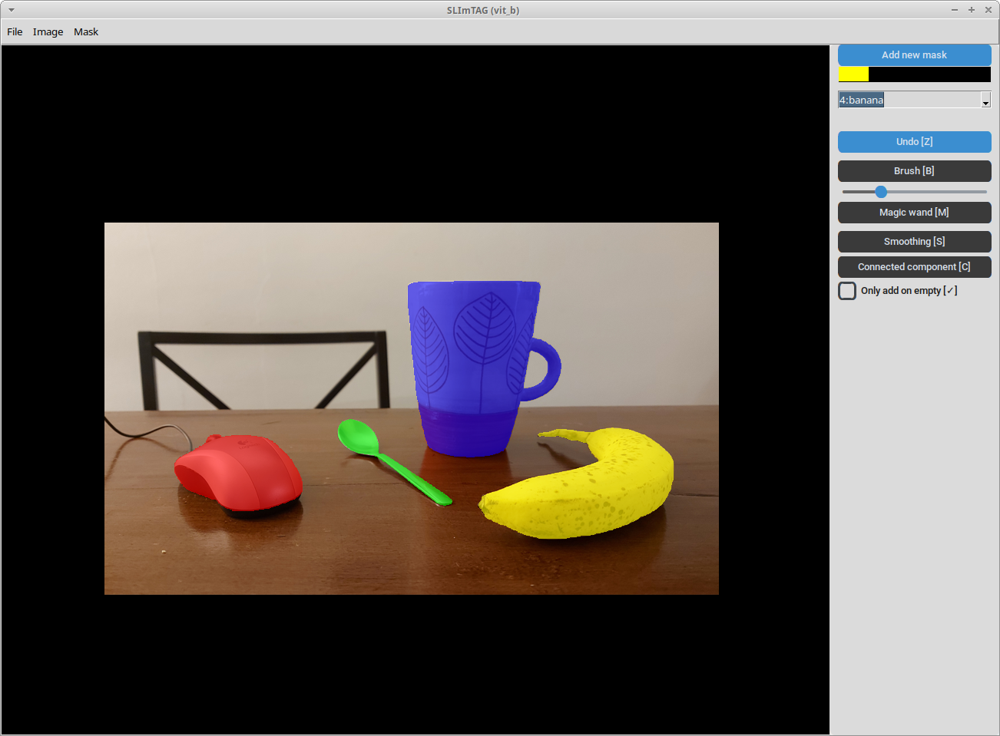

# SLImTAG – Simple Light-weight Image TAGging tool


**SLImTAG** is a simple and intuitive GUI tool for interactive image segmentation using brushes, connected components, magic wand, and SAM (Segment Anything Model). It supports multiple masks with color previews, undo, and easy saving/loading of masks.

---

## Features

- Add, select, and delete multiple tasks
- Brush tool for manual painting.
- Magic wand (SAM) for AI-assisted segmentation.
- Connected Component tool for precise selection/removal.
- Smoothing tool (dilation/erosion) for mask refinement.
- Undo support with **Ctrl-Z shortcut**.
- Save masks and load masks
- Minimal libraries requirements

---

## Requirements

Please note that the version numbers listed here refer to the environment in which SLImTAG has been tested ― it is possible that lower version will work too.

- Python 3.12
- PyTorch (for SAM): torch == 2.5.1 (CUDA 12.1 recommended if available) and torchvision == 0.20.1
- segment-anything == 1.0 (actual SAM library)
- numpy == 2.3.1 (mask manipulation)
- scipy == 1.17.0 (erosion/dilation tool)
- pillow == 12.0.0 (images management)
- customtkinter == 5.2.2 (GUI)

Also tkinter is required, but it cannot be installed via pip. On Windows it should be provided with Python; on Mac and Linux, you may need to install it through your system's package manager (e.g. `brew install python-tk` with homebrew for Mac, or `sudo apt install python3-tk` for Ubuntu-based Linux distros).

---

## Installation

1. Clone the repository

    ```bash
    git clone https://github.com/GDelCorso/SLImTAG
    cd SLImTAG
    ```

2. Create a virtual environment

    ```bash
    python3 -m venv slimtag-venv
    ```

3. Activate the environment: on Mac/Linux

    ```bash
    source slimtag-venv/bin/activate
    ```

    on Windows

    ```bash
    slimtag-venv\Scripts\activate
    ```

4. Install dependencies:

    ```bash
    python3 -m pip install -r requirements.txt
    ```

5. Download SAM's weights: download the file `sam_vit_b_01ec64.pth` from [https://github.com/facebookresearch/segment-anything](https://github.com/facebookresearch/segment-anything) (in the "Model Checkpoints" section) and place it in the `models` folder. If you have wget, you can do it via terminal:

    ```bash
    wget -O models/sam_vit_b_01ec64.pth https://dl.fbaipublicfiles.com/segment_anything/sam_vit_b_01ec64.pth
    ```

6. That's it! To run the program just do

    ```bash
    python3 SLImTag.py
    ```

    from the project folder, with the virtual environment activated.

---

## Usage



The first step is to load an image (in PNG or JPG) using `Image > Import Image` from the menu or the <kbd>Ctrl</kbd>+<kbd>I</kbd> shortcut.

### Mask Actions

Use the `Add new mask` button (shortcut: <kbd>N</kbd>) to create a new mask with a custom label. Up to 20 masks can be defined for a file. The current masks appear i a list below the button, and the active mask will be highlighted. Click on a mask to make it the active one. Keys <kbd>1</kbd>–<kbd>9</kbd> (not on the numeric pad) are shortcuts for masks with IDs 1–9.

Click on the small `×` button next to a mask to remove ALL the regions marked with it, and also remove the mask from the list. The active mask can be also removed via the menu `Mask > Clear active mask`. ALL masks can be removed via `Mask > Clear all masks`. **Any "clear mask" action cannot be undone.**

`Mask > Save Mask` saves the mask as an indexed PNG file, and a copy of the original image with a semi-transparent PNG overlay of the masks.

`Mask > Load Mask` loads a PNG representing a mask, extracting up to 20 unique colors as separate masks. Extra colors are ignored.

### Buttons

Only one tool can be selected at a time. Clicking on the active tool button (or pressing the relative shortcut key) will deselect it. The `Undo` button (also available under the `Edit` menu, or with the <kbd>Ctrl</kbd>+<kbd>Z</kbd> shortcut) undoes the last operation.

| Button / Tool           | Description                        | Shortcut     | Left click                 | Right click                   |
| ----------------------- | ---------------------------------- | ------------ | -------------------------- | ----------------------------- |
| **Brush**               | Paint or erase manually            | <kbd>B</kbd> | Paint                      | Erase                         |
| **Magic wand**          | AI-assisted segmentation (SAM)     | <kbd>M</kbd> | Add region                 | Remove region                 |
| **Connected component** | Select/remove connected areas      | <kbd>C</kbd> | Remove connected component | Keep only connected component |
| **Smoothing**           | Dilate/erode selected component    | <kbd>S</kbd> | Dilate                     | Erode                         |

The slider under the `Brush` button determines the size of the brush.

By default, tools act on the mask layer by overriding the content. The "Only add on empty" checkbox prevents this behaviour by allowing tools only to apply the active mask on regions where there are no other masks.

### Mouse Actions

See table above for the left/right click actions associated with each tool. For all of them, <kbd>Shift</kbd>+left click is equivalent to right click.

For the brush tool, click-and-drag with the **left** button follows the mouse movement. **Right** click is a bit more sluggish ― please use <kbd>Shift</kbd>+left click if needed.

Zoom is regulated via the `View` menu or by scrolling with the mouse wheel. Also <kbd>Ctrl</kbd>+<kbd>+</kbd> and <kbd>Ctrl</kbd>+<kbd>-</kbd> work for zoom in/out, and either <kbd>Ctrl</kbd>+<kbd>0</kbd> or <kbd>Ctrl</kbd>+<kbd>space</kbd> reset the zoom.

When **no** tool is selected, left click-and-drag to pan the image.

---

## TO-DO LIST and BUGFIX:

### Major
- [x] Rewrite GUI (but improvements are welcome!)
- [ ] Redefine zoom function (by avoiding update loop on subselection)
- [ ] Ctrl+magic wand: multiple conditional points (left: positive, right: negative), activate SAM at release Ctrl, and mask preview

### Minor
- [ ] Zoom on mouse location instead of top left corner
- [x] Add statusbar
- [ ] Brush subraction and connected component currently don't work when "Only add on empty" is active
- [ ] Implement argparse with "--no-sam" option that disables SAM (disable button; avoid libraries import; deactivate SAM loading in `load_image`; add requirements-no-sam.txt)
- [ ] Integrate PyInstaller and generate Windows binary (both with and without SAM)
- [ ] Convert hardcoded parameters to argparse arguments
- [ ] SAM click-and-drag: apply to selected bounding box (at release) (both positive and negative)
- [ ] To consider: in smoothing tool, add toggle for locking mask at image border, so that it is not erased (useful if mask is background)
- [x] Add <kbd>Q</kbd> (or <kbd>Ctrl</kbd>+<kbd>Q</kbd>) as quit shortcut
- [ ] Define an additional .csv containing name/mask value bindings for semantic segmentation when needed
- [x] When a mask is removed, a new mask additions should be placed on the first empty value of the list
- [x] Track if a mask is unsaved, and prompt a "There are unsaved changes to the mask. Quit anyway?" message accordingly (check to be added in `quit_program` method)
- [ ] "Unsaved changes" status does not look at the undo history ― if you open a mask, do something, then undo, the mask will still be considered "modified"
- [ ] Allow "Clean Mask" undo
- [ ] BUG: when undoing Brush, the first position does not get undone (and sometimes cannot be undone)
- [ ] Add toggle "hide mask" in mask list (to consider: is a hidden mask saved? can a hidden mask be modified?)
- [ ] Smoothing on image border/contours of another mask, should not reduce dimension

### Potential additional features
- [ ] Different brush shapes (square)
- [ ] Rectangle/polygonal "add to mask" tool
- [ ] Define plugins for different features to mantain the system lightweight and make it adaptable to user experience
- [ ] Add button "invert mask"
- [ ] Add "save png with mask as alpha channel"
- [ ] Add "paint bucket" that changes color of (connected component of) mask with active mask

### Extension to bio-medical fields
- [ ] Import MedSAM and modify the MagicWand wrapper
- [ ] Import also .nrrd and .nifti files for MRI/scan segmentation
- [ ] Allows to import 3D (i.e., ordered list of 2D elements) views for 3D MRI scans and video segmentation
