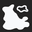
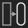

# WARNING: DEMO and Current GUI status
The GUI has undergone a total restyling to make it more suitable for demo presentations and intensive usage in a more professional context.
Therefore, several already working features (including *non-neural segmentation methods*, *modules*, and *Bayesian updates*) have been temporarily disabled. We are currently re-integrating them, and we expect to merge the older working version with the current one before the 15th of May.

However, the current version is a fully functioning interface with a novel graphical aspect and a highly efficient, analytically reference-based patching mechanism, combined with standard brushing, cleaning, smoothing, and Neural Network Segmentation features.


Particular focus on:
- [ ] Integrate non-neural methods [Gdc]
- [ ] Integrate existing *load* nrrd, nifti, etc. modules [Gdc]
- [ ] Upload (already tested) Bayesian module [Gdc]
- [ ] Change existing 3D visualization to ease the read on biomedical settings [Op]
- [x] Tooltip hover [Op]
- [x] Preview multipoint improvement [Op]
- [ ] Re-activate exitings tools in the novel graphical interface [All]
- [ ] Define boundaries visualization [Fv]
- [ ] Load fex example images/nrrds


# SLImTAG – Simple Light-weight Image TAGging tool


**SLImTAG** is a simple and intuitive GUI tool for interactive image segmentation using brushes, connected components, magic wand, and SAM (Segment Anything Model). It supports multiple masks with color previews, undo, and easy saving/loading of masks.

---

## Features

- Add, manage and delete multiple masks.
- Magic wand for AI-assisted segmentation using SAM.
- Brush tool for manual painting.
- Cut and clear tools for precise selection/removal of connected components.
- Smoothing tool (dilation/erosion) for mask refinement.
- Undo support with **Ctrl-Z shortcut**.
- Save and load masks in lightweight PNG format.
- Minimal libraries requirements.

---

## Requirements

Please note that the version numbers listed here refer to the environment in which SLImTAG has been tested ― it is possible that lower version will work too.

- Python 3.12
- PyTorch (for SAM): torch == 2.5.1 (CUDA 12.1 recommended if available) and torchvision == 0.20.1
- segment-anything == 1.0 (actual SAM library)
- numpy == 2.3.1 (mask manipulation)
- scipy == 1.17.0 (erosion/dilation tool)
- pillow == 12.0.0 (images management)
- customtkinter == 5.2.2 (GUI)
- screeninfo == 0.8.1 (recover screen info for UI management)
- tomlkit == 0.14.0 (configuration file management)

Also tkinter is required, but it cannot be installed via pip. On Windows it should be provided with Python; on Mac and Linux, you may need to install it through your system's package manager (e.g. `brew install python-tk` with homebrew for Mac, or `sudo apt install python3-tk` for Ubuntu-based Linux distros).

---

## Installation

1. Clone the repository

    ```bash
    git clone https://github.com/GDelCorso/SLImTAG
    cd SLImTAG
    ```

2. Create a virtual environment

    ```bash
    python3 -m venv slimtag-venv
    ```

3. Activate the environment: on Mac/Linux

    ```bash
    source slimtag-venv/bin/activate
    ```

    on Windows

    ```bash
    slimtag-venv\Scripts\activate
    ```

4. Install dependencies:

    ```bash
    python3 -m pip install -r requirements.txt
    ```

5. Download SAM's weights: download the file `sam_vit_b_01ec64.pth` from [https://github.com/facebookresearch/segment-anything](https://github.com/facebookresearch/segment-anything) (in the "Model Checkpoints" section) and place it in the `models` folder. If you have wget, you can do it via terminal:

    ```bash
    wget -O models/sam_vit_b_01ec64.pth https://dl.fbaipublicfiles.com/segment_anything/sam_vit_b_01ec64.pth
    ```

6. That's it! To run the program just do

    ```bash
    python3 SLImTag.py
    ```

    from the project folder, with the virtual environment activated.

---

## Usage

### Import Images

The first step is to load an image (in PNG or JPG) using `Image > Import image` from the menu or the <kbd>Ctrl</kbd>+<kbd>I</kbd> shortcut.

### Mask Actions

Use the `+ New mask` button (shortcut: <kbd>N</kbd>) to create a new mask with a custom label. Up to 20 masks can be defined for a file. The current masks appear in a list below the button, and the active mask will be highlighted. Click on a mask to make it the active one. Keys <kbd>1</kbd>–<kbd>9</kbd> (not on the numeric pad) are shortcuts for masks with IDs 1–9. <kbd>Tab</kbd> (respectively <kbd>Shift</kbd>+<kbd>Tab</kbd>) cycles through the masks, selecting the next (respectively previous) one as active.

Click on the small `×` button next to a mask to remove ALL the regions marked with it, and also remove the mask from the list. The active mask can be also removed via the menu `Mask > Clear active mask`. ALL masks can be removed via `Mask > Clear all masks` or the `×` button on top of the masks list. **Any "clear mask" action cannot be undone.**

Right-clicking on a mask opens a contextual menu with the options to edit the mask (i.e., change its name and/or color), delete it, or set it as the active mask.

`Mask > Save mask` (shortcut: <kbd>Ctrl</kbd>+<kbd>S</kbd>) saves the mask as an indexed PNG file with its default name and position, namely, the mask will have the same name as the original image with `_mask` appended, and will be placed in the same folder. `Mask > Save mask as...` instead allows the user to choose a name and position for the mask.

`Mask > Load mask` loads a PNG representing a mask, extracting up to 20 unique colors as separate masks. Extra colors are ignored.

The `Hide mask` (eye icon) and `Lock mask` (padlock) icons for each mask respectively hide and lock the corresponding mask. A hidden mask won't be displayed in the interface (but it will be saved). A locked mask cannot be overwritten by _other_ masks (but can be modified if it is the active mask). The icons on top of the list correspond to `Hide all masks`/`Lock all masks` functions.

Mask opacity can be regulated through the slider on the bottom of the interface.

### Buttons

Only one tool can be selected at a time. Clicking on the active tool button (or pressing the relative shortcut key) will deselect it. The `Undo` button (also available under the `Edit` menu, or with the <kbd>Ctrl</kbd>+<kbd>Z</kbd> shortcut) undoes the last operation.

| Button / Tool           | Description                        | Shortcut     | Left click                 | Right click                   |
| ----------------------- | ---------------------------------- | ------------ | -------------------------- | ----------------------------- |
|  **Brush**               | Paint or erase manually            | <kbd>B</kbd> | Paint                      | Erase                         |
|  **Eraser**               | Erase manually            | – | Erase                      | –                         |
|  **Magic wand**          | AI-assisted segmentation (SAM)     | <kbd>M</kbd> | Add region                 | Remove region                 |
|  **Multipoint magic wand**          | AI-assisted segmentation (SAM)     | – | Add positive point                 | Add negative point                 |
|  **Cut** | Select/remove connected areas      | <kbd>C</kbd> | Remove connected component | Keep only connected component |
|  **Clean** | Select/remove connected areas      | – | Keep only connected component | – |
|  **Smoothing**           | Smooth component boundary   | <kbd>S</kbd> | Erode, then dilate                  | Dilate, then erode                         |

Options available for each tool appear on the right side of the interface, under the masks list.

### Mouse Actions

See table above for the left/right click actions associated with each tool. For all of them, <kbd>Shift</kbd>+left click is equivalent to right click.

For the brush tool, click-and-drag with the **left** button follows the mouse movement. **Right** click is a bit more sluggish ― please use <kbd>Shift</kbd>+left click if needed.

Zoom is regulated via the `View` menu or by scrolling with the mouse wheel. Also <kbd>Ctrl</kbd>+<kbd>+</kbd> and <kbd>Ctrl</kbd>+<kbd>-</kbd> work for zoom in/out, and either <kbd>Ctrl</kbd>+<kbd>0</kbd> or <kbd>Ctrl</kbd>+<kbd>space</kbd> reset the zoom.

When **no** tool is selected, left click-and-drag to pan the image. This can also be done using the middle-click (i.e., by clicking on the mouse wheel), even when a tool is selected.

### Multipoint SAM

While the magic wand is selected, you can press and hold <kbd>Ctrl</kbd> to enter "multipoint mode". In this mode, a single left click adds a "positive" point (i.e., belonging to the mask) for SAM segmentation, and a single right click adds a "negative" point (i.e., belonging to the background). The mask is then computed and added when <kbd>Ctrl</kbd> is released.

The multipoint magic wand is also provided as a standalone tool. In this case, there is no need to hold any button: positive and negative points are added with left and right clicks respectively. The candidate mask is updated at each click, then either press <kbd>Enter</kbd> to confirm and apply it or press <kbd>Esc</kbd> to discard it.

---

## TO-DO LIST and BUGFIX:

### Major
- [x] Rewrite GUI (but improvements are welcome!)
- [x] Redefine zoom function (by avoiding update loop on subselection)
- [x] Ctrl+magic wand: multiple conditional points (left: positive, right: negative), activate SAM at release Ctrl, and mask preview

### Minor

#### General

- [ ] ~~Implement argparse with `--no-sam` option that disables SAM (disable button; avoid libraries import; deactivate SAM loading in `load_image`; add requirements-no-sam.txt)~~
- [ ] ~~ALTERNATIVE: implement classic scipy's region detection algorithms that are bound to magic wand when SLImTAG is called with `--no-sam`~~
- [x] Implement configuration file that is checked at startup with all the parameters
- [ ] Integrate PyInstaller and generate Windows binary (both with and without SAM)
- [ ] ~~Convert hardcoded parameters to argparse arguments~~
- [ ] Define an additional .csv containing name/mask value bindings for semantic segmentation when needed
- [ ] Folder management improvements (add checks, better save options, warnings before overwriting, add "previous image")
- [x] Move color picker to utils (and cleanup its code)
- [x] When an image is loaded, add the file name to window title (e.g. "SLImTAG (model) - image_name.png", or "SLImTAG (model) [image_name.png]"). Maybe move model name to statusbar instead of window title?

#### UI

- [x] Add statusbar
- [x] Add <kbd>Q</kbd> (or <kbd>Ctrl</kbd>+<kbd>Q</kbd>) as quit shortcut
- [x] Track if a mask is unsaved, and prompt a "There are unsaved changes to the mask. Quit anyway?" message accordingly (check to be added in `quit_program` method)
- [ ] "Unsaved changes" status does not look at the undo history ― if you open a mask, do something, then undo, the mask will still be considered "modified"
- [x] Bind Tab/Shift-Tab to cycle between masks
- [ ] `color_palette.json`: check consistency, upgrade for light mode
- [ ] Change placeholder icons `images/buttons/*_light_*.png` and `images/icons/*_light_*.png` with light mode versions
- [ ] Upgrade main icon

#### View

- [x] Zoom on mouse location instead of top left corner
- [ ] ~~PROBABLY NO MORE NECESSARY: Define a function "compute_zoom_limits(self)" that computes min and max zoom -- see commented pseudocode~~

#### Masks management

- [ ] ~~BUG: Brush subraction and connected component currently don't work when "Only add on empty" is active~~
- [x] When a mask is removed, a new mask additions should be placed on the first empty value of the list
- [ ] Allow "Clean Mask" undo
- [x] Add toggle "hide mask" in mask list (to consider: is a hidden mask saved? can a hidden mask be modified?)
- [x] Add toggle "lock mask" in mask list to prevent overwriting per-mask as well as any mask
- [ ] TO CONSIDER: allow opening a mask without an underlying image for direct mask editing (maybe create a dummy black image with suitable size, to be discarded)

#### Brush

- [ ] BUG: when undoing Brush, the first position does not get undone (and sometimes cannot be undone)

#### Magic wand

- [ ] SAM click-and-drag: apply to selected bounding box (at release) (both positive and negative)
- [x] BUG: when applying pan/zoom during SAM-multipoints, the preview markers should follow the user perspective

#### Smoothing

- [ ] TO CONSIDER: in smoothing tool, add toggle for locking mask at image border and/or other masks border, so that it is not erased (useful e.g. if mask is background)

### Potential additional features
- [ ] Different brush shapes (square)
- [ ] Rectangle/polygonal "add to mask" tool
- [ ] Define plugins for different features to mantain the system lightweight and make it adaptable to user experience
- [ ] Add button "invert mask"
- [ ] Add "save png with mask as alpha channel"
- [ ] Add "paint bucket" that changes color of (connected component of) mask with active mask

### Extension to bio-medical fields
- [ ] Import MedSAM and modify the MagicWand wrapper
- [ ] Import also .nrrd and .nifti files for MRI/scan segmentation
- [ ] Allows to import 3D (i.e., ordered list of 2D elements) views for 3D MRI scans and video segmentation
- [ ] Anonymization tool (integrated in save as nrrd/nifti) *or* in the load button
